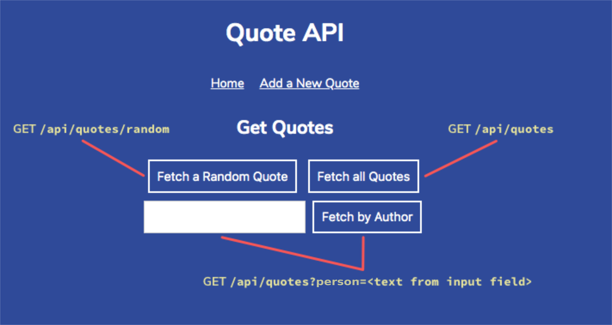

# Quote API

## **Overview**

This is a small **JSON API** for serving quotes about computers, programming, and technology. It's a project built with **Node.js** and **Express.js**, designed to be simple and effective.

## **Features**

* **Quote serving:** The API offers several endpoints to retrieve quotes.
* **Filter by author:** Allows you to search for quotes by a specific author.
* **Add new quotes:** Allows you to add new quotes to the collection.

## **Frontend Visualization**

To understand how the API endpoints are used, see the frontend diagram below, which illustrates the different routes and their respective buttons:



## **API Endpoints**

The API is available at the path `/api/quotes`.

| HTTP Method | Endpoint | Description | Query Parameters | Example Response |
| :--- | :--- | :--- | :--- | :--- |
| `GET` | `/api/quotes/random` | Returns a random quote. | N/A | `{ "quote": { "quote": "Random Quote", "person": "Author" } }` |
| `GET` | `/api/quotes` | Returns all quotes. | `person` (optional): Filters quotes by author. | `{ "quotes": [{ "quote": "Quote 1", "person": "Author 1" }, ...] }` |
| `POST` | `/api/quotes` | Adds a new quote. | `quote` (required): The quote text. <br> `person` (required): The quote's author. | `{ "quote": { "quote": "New Quote", "person": "New Author" } }` |

### **Usage Examples**

* **Fetch all quotes:**
  `GET /api/quotes`

* **Fetch quotes by a specific author (e.g., "Grace Hopper"):**
  `GET /api/quotes?person=Grace%20Hopper`

* **Add a new quote:**
  `POST /api/quotes?quote=The%20path%20to%20code%20is%20an%20endless%20loop%20of%20trial%20and%20error.&person=Robson16`

## **Getting Started**

Follow the instructions below to set up and run the **`quote-api`** locally.

### **Prerequisites**

Make sure you have **Node.js** and **npm** (or **yarn**) installed on your machine.

### **Installation**

1.  **Clone the repository:**

    ```bash
    git clone [https://github.com/Robson16/quote-api.git](https://github.com/Robson16/quote-api.git)
    cd quote-api
    ```

2.  **Install dependencies:**

    ```bash
    npm install
    ```

### **How to Use**

1.  **Start the API in development mode:**

    ```bash
    npm run dev
    ```

    This will start the server with **Nodemon**, which will automatically restart upon file changes.

2.  **Start the API in production mode:**

    ```bash
    npm start
    ```

    This will start the server using **Node.js**.

3.  **Access the Front-End:**

    To interact with the front-end at: `http://localhost:4001`.

## **Technologies Used**

* **Node.js**: A **JavaScript** runtime environment.
* **Express**: A web framework for **Node.js**.
* **Nodemon**: A development tool that automatically restarts the server.

## **License**

This project is under the **MIT License**. See the [LICENSE](https://opensource.org/licenses/MIT) file for more details.

---
Made with ❤️ by **Robson16**.